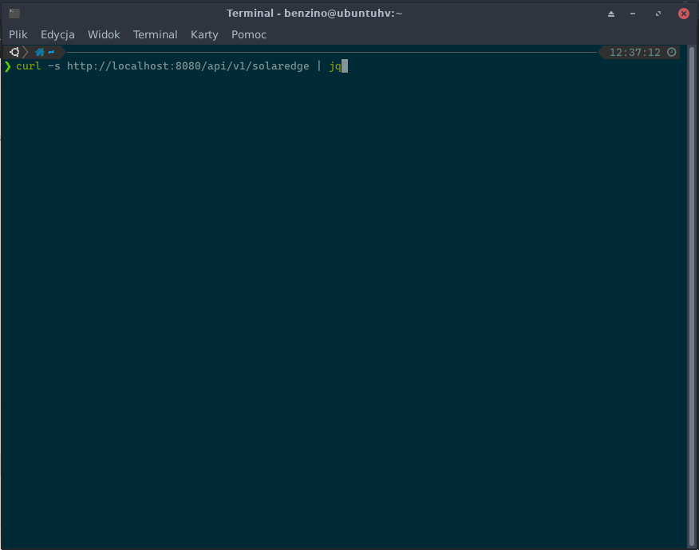

## SolarEdge Inverter REST API

Super simple REST api to Solaredge Inverter, based on [solaredge_modbus](https://github.com/nmakel/solaredge_modbus) project and Flask. It is using MODBUS over TCP. Information how to turn on MODBUS over TCP in your Inverter can be found on solaredge documentation page or in included [PDF](https://github.com/benzino77/solaredge-rest-api/documents/sunspec-implementation-technical-note.pdf)

### Usage
The  api endpoint is `/api/v1/solaredge` and it is reachable by simple GET request:




### Install

### Docker
The simplest way to start it is by usinf docker:

`docker run --rm -p 8080:8080 -e MODBUS_HOST=<ip_address_of_modbus_inverter_interface> -e MODBUS_PORT=<modbus_inverter_interface_port> benzino77/solaredge-rest-api`

for example:
```bash
docker run --rm -p 8080:8080 -e MODBUS_HOST=192.168.10.5 -e MODBUS_PORT=1502 benzino77/solaredge-rest-api
```

The `1502` is a default port (I think).

### Run locally
You can also run it locally (I do prefer to use python virtualenv for projects to keep my environment clean):


```bash
git clone https://github.com/benzino77/solaredge-rest-api
cd solaredge-rest-api
python3 -m venv myvenv
source myvenv/bin/activate
pip install -r requirements.txt
MODBUS_HOST=192.168.10.5 MODBUS_PORT=1502 gunicorn --bind :8080 --workers 1 --threads 8 --timeout 0 server:app
```
